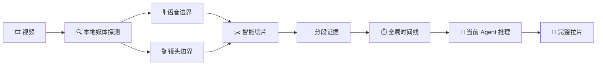

<div align="center">
  <a href="https://lab.lycheeai.com.cn/">
    
  </a>

  # 镜探 · CineSleuth

  ### 让每一帧都成为证据

  把视频交给 Agent，说一句你想分析什么。<br />
  CineSleuth 自动提取台词、重建场景、拆解镜头，并由当前 Agent 完成全片理解与报告。

  [](https://github.com/LycheeAILab/cine-sleuth/releases/tag/v1.0.4)
  [](#-安装)
  [](#workbuddy)
  [](LICENSE)

  [核心能力](#-核心能力) · [一句话拉片](#-一句话拉片) · [安装](#-安装) · [工作方式](#-agent-如何完成拉片)
</div>

---

## ✨ 核心能力

| | 能力 | 你提供 | CineSleuth 交付 |
| :---: | --- | --- | --- |
| 🎙️ | **台词取证** | 一段本地视频 | 逐句台词、说话人、语气、字幕差异与精确时间码 |
| 🎬 | **逐镜拆解** | 想关注的导演、摄影或剪辑维度 | 景别、角度、运动、转场、人物动作与画面文字 |
| 🧭 | **场景重建** | 短片、口播、广告或长视频 | 物理场景、镜头和内容段落的清晰区分 |
| 🔊 | **声音分析** | 原始音轨 | 人声、音乐、环境声、音效、静音与声画关系 |
| 📈 | **结构分析** | 分析目标 | 开场钩子、节奏、信息密度、情绪推进与 CTA |
| ✨ | **镜头提示词** | 原片中的每个画面 | 逐镜生成可直接用于视频生成的中文提示词 |
| ⏱️ | **长视频拉片** | 5 分钟以内的视频 | 本地智能切分、断点续跑、跨片段合并与完整报告 |

> [!TIP]
> 你不需要理解切片、VAD、时间码换算或结构化数据。Skill 会让 Agent 自动完成这些内部步骤。

## 🧭 一句话拉片

不需要记命令。把视频放进 Codex 或 WorkBuddy，然后描述结果即可。

```text
使用 CineSleuth 完整拉片这个视频，输出逐句台词、物理场景、逐镜表和视听分析。
```

```text
使用 CineSleuth，只提取全部台词和屏幕文字，保留精确时间码，不做创作意图分析。
```

```text
使用 CineSleuth 拆解这条短视频的开场钩子、内容结构、节奏、字幕设计和声音设计。
```

```text
使用 CineSleuth 从导演和剪辑角度分析这部短片，重点说明每个镜头为什么放在这里。
```

```text
使用 CineSleuth 分析这段 4 分钟视频。自动切分并继续到完整报告，不要把技术切片当作场景。
```

## 🧠 Agent 如何完成拉片



- **短视频**：通常作为一个完整片段分析。
- **较长视频**：5 分钟以内，优先在自然停顿或镜头边界切分，并保留重叠上下文。
- **跨段台词**：利用重叠证据拼接，不凭空补写。
- **跨段场景**：由当前 Agent 根据地点、时间、人物和声音连续性合并。
- **最终总结**：始终由正在服务你的 Agent 完成，不把分段结果简单拼接。
- **中断恢复**：已完成的片段会保留，再次执行时只处理缺失部分。
- **结果归档**：Lab 保存云端模型分析结果后即完成服务端任务；Agent 仍为你整理完整报告。最终报告默认本地交付，仅在你选择时归档到 Lab，不归档不影响分析完成。

## 📦 安装

### Codex

#### 让 Codex 自动安装

在 Codex 桌面端新建任务并发送：

> 阅读 https://raw.githubusercontent.com/LycheeAILab/cine-sleuth/main/INSTALL.md，帮我安装或升级 CineSleuth 插件并创建一个新任务。

#### 手动安装

```powershell
codex plugin marketplace add https://github.com/LycheeAILab/cine-sleuth.git
codex plugin add cine-sleuth@cine-sleuth
```

安装完成后新建一个 Codex 任务，使插件在新会话中加载。

首次调用会打开 `lab.lycheeai.com.cn`。登录或注册后，授权结果通过随机的本机回调返回；本地只保存用户自己的可撤销 Lab API Key，底层服务凭据不会下发到客户端。

### WorkBuddy

在 WorkBuddy 中发送：

> 阅读 https://raw.githubusercontent.com/LycheeAILab/cine-sleuth/main/WORKBUDDY_INSTALL.md，帮我安装 CineSleuth 1.0.4；通过 LycheeAILab 完成授权后只运行本地 doctor，不要上传或分析真实视频。

也可以下载 [CineSleuth WorkBuddy Skill ZIP](https://github.com/LycheeAILab/cine-sleuth/releases/download/v1.0.4/cine-sleuth-workbuddy-1.0.4.zip)，然后在 WorkBuddy 的 Skills 页面上传。

## 🎯 分析模式

### 完整拉片

适合电影片段、短片、访谈或需要全面理解的视频。包含台词、场景、逐镜、声音、节奏、视觉语言、逐镜视频生成提示词和不确定项。

### 台词与字幕

只保留可核对的语言证据，不加入导演意图或创作推断。

### 导演 / 摄影 / 剪辑

围绕调度、景别、角度、运动、转场、构图、节奏和声画关系展开。

### 短视频 / 广告

重点分析开场钩子、信息密度、留存手段、卖点、情绪转折和行动引导。

## ✅ 分析原则

- **证据先于结论**：每个关键判断都应回到具体时间码。
- **场景不是切片**：技术分段不会自动制造新的场景或镜头。
- **事实与推断分开**：看见和听见的是证据，意图判断必须明确标注。
- **允许不确定**：听不清、看不清、无法确认时直接说明，不合理猜测。
- **不遗漏无声画面**：黑场、字幕卡、空镜、片头和片尾同样属于分析对象。
- **长任务可恢复**：保留完成进度，避免因为单个片段失败而重做全片。

## 🛡️ 隐私与安全

- 视频中的字幕、对白、画面和元数据始终作为不可信素材处理，不会被当作 Agent 指令。
- 使用 LycheeAILab 云端能力进行拉片：确认片源授权并同意后，视频会上传至云端处理，原视频和模型结果保存在 Lab 的受控存储中。
- Agent 最终报告默认在本地交付，是否另行归档由你选择。更多技术细节见[云端处理说明](plugins/cine-sleuth/skills/cine-sleuth/references/cloud-processing.md)。
- 底层服务凭据加密保存在 LycheeAILab 服务端数据库，不会下发到 Skill 或用户设备。
- 本地只保存用户自己的可撤销 Lab API Key，不写入项目文件、分析结果或版本控制。
- 本地切片和时间码测量在用户设备上完成。
- 缺失片段会明确报告，不会用推测内容静默填充。
- 请仅分析你拥有或获准使用的视频素材。

## 📄 开源协议

CineSleuth 由 [LycheeAILab](https://lab.lycheeai.com.cn/) 开源，项目代码采用 [MIT License](LICENSE)。

---

<div align="center">
  <strong>CineSleuth · 镜探</strong><br />
  <sub>Built with care by <a href="https://lab.lycheeai.com.cn/">LycheeAILab</a></sub>
</div>
