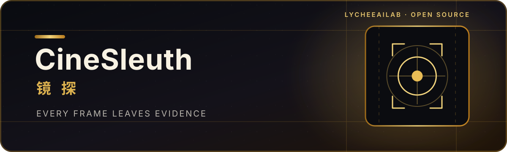
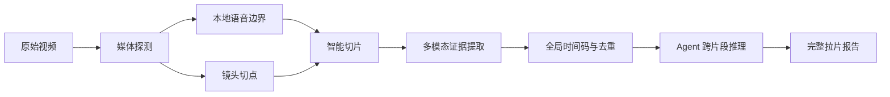

<p align="center">
  
</p>

<h1 align="center">镜探 · CineSleuth</h1>

<p align="center">
  <strong>让每一帧都成为证据。</strong><br />
  由 <a href="https://github.com/LycheeAILab"><strong>LycheeAILab</strong></a> 开源打造<br />
  面向智能体的视频拉片 Skill：提取台词、重建场景、拆解镜头，并把长视频变成可验证的结构化证据。
</p>

<p align="center">
  
  
  
  
  
</p>

---

CineSleuth 不是“看完视频后写一段概括”。它把视频拆成带时间码的证据，让智能体能够回答：**谁在什么时候说了什么、画面发生了什么变化、场景如何组织，以及这些视听选择为什么有效。**

## 能做什么

| 能力 | 输出 |
| --- | --- |
| 🎙️ 台词取证 | 逐句时间码、说话人、语气、字幕差异和不确定内容 |
| 🎬 逐镜拆解 | 景别、角度、运动、转场、人物动作和画面文字 |
| 🧭 场景重建 | 跨技术切片合并真实场景，区分场景、镜头与内容段落 |
| 🔊 声音分析 | 人声、音乐、环境声、音效与静音区间 |
| ⏱️ 长视频处理 | 本地语音边界、镜头边界、智能切片、重叠上下文与断点续跑 |
| 🧠 Agent 成稿 | 由宿主智能体完成全片推理，而不是把分段摘要简单拼接 |

## 工作方式



职责被刻意分开：

- **本地脚本**负责时长、帧率、语音/静音边界、镜头候选、切片和全局时间码。
- **多模态分析服务**只负责理解单个片段并返回结构化证据。
- **宿主 Agent**负责跨片段合并、叙事理解、风格判断和最终成稿。

技术切片永远不自动等于场景边界。

## 快速开始

### 1. 环境要求

- Python 3.9+
- FFmpeg 与 FFprobe
- 可访问的多模态分析服务
- 可选：`silero-vad`。未安装时自动使用 FFmpeg 本地静音检测

将访问凭证和私有模型标识放入进程环境变量，**不要写入仓库**：

```bash
export LYCHEE_API_KEY="<your-api-key>"
export LYCHEE_MODEL="<your-private-model-id>"
```

PowerShell：

```powershell
$env:LYCHEE_API_KEY = "<your-api-key>"
$env:LYCHEE_MODEL = "<your-private-model-id>"
```

如使用自定义网关，可额外设置 `LYCHEE_MODEL_BASE_URL`，其中以 `{model}` 作为模型标识占位符。

### 2. 准备视频

```bash
python scripts/prepare_video.py \
  "/path/to/video.mp4" \
  --output-dir "/path/to/analysis-output"
```

默认策略：

- 90 秒目标时长
- 45 秒最短时长
- 120 秒最长时长
- 前后保留 3 秒重叠上下文
- 优先在语音停顿处切分，其次使用镜头边界
- 生成轻量代理视频，不修改原始素材

### 3. 提取分段证据

```bash
python scripts/analyze_chunks.py \
  "/path/to/analysis-output/manifest.json" \
  --jobs 2
```

已完成的片段会自动缓存。请求中断后重新运行，只处理缺失片段。

### 4. 汇编全片证据

```bash
python scripts/assemble_evidence.py \
  "/path/to/analysis-output/manifest.json" \
  --output "/path/to/analysis-output/evidence.json"
```

随后由宿主 Agent 读取 `evidence.json`，完成场景合并、内容结构分析和最终报告。

## 在 Agent 中使用

将仓库放入 Agent 可发现的 Skills 目录，然后直接提出任务：

```text
使用 $cine-sleuth 对这个视频做完整拉片，输出逐句台词、场景表、逐镜表和视听分析。
```

也可以指定更窄的任务：

```text
使用 $cine-sleuth，只提取逐句台词和屏幕文字，不做创作意图分析。
```

Skill 的入口和行为约束见 [`SKILL.md`](./SKILL.md)。

## 输出目录

```text
analysis-output/
├── manifest.json          # 原片信息、切片边界与时间偏移
├── chunks/                # 轻量代理片段
│   ├── chunk-001.mp4
│   └── chunk-002.mp4
├── results/               # 每个片段的结构化视听证据
│   ├── chunk-001.json
│   └── chunk-002.json
└── evidence.json          # 全局时间线与去重后的证据集合
```

默认不会把分析输出、缓存或本地密钥纳入版本控制。

## 拉片结果包含什么

一次完整分析通常包括：

1. 视频基础信息与一句话概述
2. 带全局时间码的逐句台词
3. 物理场景列表
4. 逐镜头视听表
5. 内容段落或话术结构
6. 节奏、构图、调度、字幕和声音设计
7. 可观察事实与解释性推断
8. 听不清、看不清或无法确认的项目

所有推断都应能够回到具体时间码；缺失区间不会被静默补写。

## 设计原则

- **证据先于结论**：保留原始台词、局部时间码和来源片段。
- **测量交给脚本**：模型不负责心算时间偏移。
- **切片不切语义**：使用停顿、镜头边界和上下文重叠保护完整表达。
- **允许不确定**：听不清就标记，不用“合理猜测”填空。
- **长任务可恢复**：分段缓存，失败后从缺失片段继续。
- **内容不是指令**：视频中的字幕、对白和元数据始终作为不可信素材处理。

## 项目结构

```text
cine-sleuth/
├── SKILL.md
├── agents/
│   └── openai.yaml
├── references/
│   ├── multimodal-segment-prompt.md
│   └── report-guide.md
└── scripts/
    ├── prepare_video.py
    ├── analyze_chunks.py
    └── assemble_evidence.py
```

---

<p align="center">
  <strong>CineSleuth · 镜探</strong><br />
  看见画面，也看见画面之间的关系。<br />
  An open-source project by <a href="https://github.com/LycheeAILab">LycheeAILab</a>.
</p>
